# Introduction

This document is an analysis of the search algorithms and heuristics that were
used to solve the three Air cargo problems described in the project.

In the first part, we will prepare the data prior to our exploration.

Then, we will review the characteristics associated to AI search algorithms:

1. __optimality__
2. __completeness__
3. __time complexity__
4. __space complexity__

Finally, we will suggest which algorithm should be used in our domain.

# Preparation

The experimental settings were as follows:

* __search limit__: up to the memory limit (16 GiB), no timeout
* __elements tested__: all problems (3) and searches (10) were tested
* __benchmark script__: a modified _run\_search.py_ that output json files
* __hardware__: 8 Processor Intel Core i7 CPU 2.50 GHz, 16 GiB of RAM

\newpage

# Exploration

## Results

This table summarizes the results of the execution of _run\_search.py_.

Problem  | Search                                 | Plan length  | Nodes created | Time
:------: |:------                                 |------------: |----------:    |-------:
1        | astar search - h 1                     | 6            | 224           | 0.11
1        | astar search - h ignore preconditions  | 6            | 170           | 0.07
1        | astar search - h pg levelsum           | 6            | 50            | 2.31
1        | breadth first search - uninformed      | 6            | 180           | 0.02
1        | breadth first tree search - uninformed | 6            | 5960          | 1.59
1        | depth first graph search - uninformed  | 20           | 84            | 0.02
1        | depth limited search - uninformed      | 50           | 414           | 0.14
1        | greedy best first graph search - h 1   | 6            | 28            | 0.01
1        | recursive best first search - h 1      | 6            | 17023         | 4.50
1        | uniform cost search - uninformed       | 6            | 224           | 0.04
2        | astar search - h 1                     | 9            | 44041         | 86.06
2        | astar search - h ignore preconditions  | 9            | 13820         | 26.63
2        | astar search - h pg levelsum           | 9            | 1120          | 248.13
2        | breadth first search - uninformed      | 9            | 30509         | 21.99
2        | depth first graph search - uninformed  | 619          | 5602          | 5.49
2        | depth limited search - uninformed      | 50           | 2054119       | 1656.40
2        | greedy best first graph search - h 1   | 15           | 299           | 0.13
2        | uniform cost search - uninformed       | 9            | 44041         | 84.18
3        | astar search - h 1                     | 12           | 159726        | 939.07
3        | astar search - h ignore preconditions  | 12           | 45650         | 218.74
3        | astar search - h pg levelsum           | 12           | 3724          | 1216.33
3        | breadth first search - uninformed      | 12           | 129631        | 213.48
3        | depth first graph search - uninformed  | 392          | 3364          | 2.49
3        | greedy best first graph search - h 1   | 24           | 40379         | 258.49
3        | uniform cost search - uninformed       | 12           | 159726        | 966.41

## Completeness

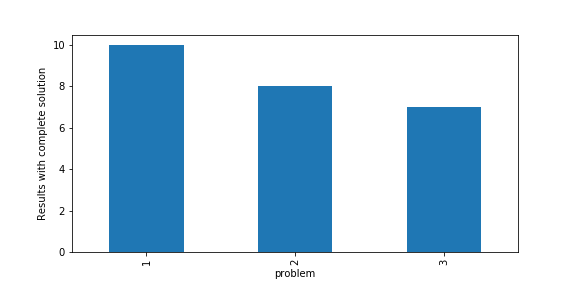

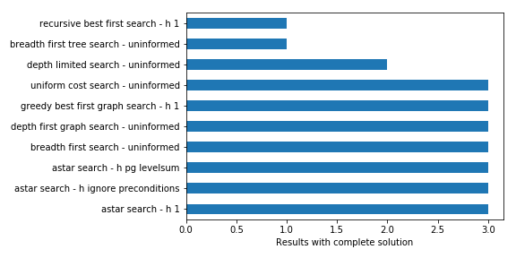

Out of 30 cases, 25 cases have a complete solution in our settings.

We can see from Figure \ref{complete-problem} that it is easier to find a
complete solution for smaller problems (e.g. Problem 1) than larger problems
(e.g. Problem 3).

We can see from Figure \ref{complete-search} that some searches that were
supposed to had a complete solution (@modern) did not complete in our settings.
This is the case for breadth-first tree and A* search. The most plausible reason
would be the lack of memory on the experimental machine.

On the contrary, some searches which do not guarantee completeness, such as
greedy-best-first graph search and depth-first graph search (@modern), had a
complete solution. As mentioned in our textbook (@modern), these algorithms are
still able to find a solution in some cases, and the result do not contradict
that we learned in the session.

Problem  | Search                                 | Complete
:------: |:-------                                |:-------:
1        | astar search - h 1                     | true
1        | astar search - h ignore preconditions  | true
1        | astar search - h pg levelsum           | true
1        | breadth first search - uninformed      | true
1        | breadth first tree search - uninformed | true
1        | depth first graph search - uninformed  | true
1        | depth limited search - uninformed      | true
1        | greedy best first graph search - h 1   | true
1        | recursive best first search - h 1      | true
1        | uniform cost search - uninformed       | true
2        | astar search - h 1                     | true
2        | astar search - h ignore preconditions  | true
2        | astar search - h pg levelsum           | true
2        | breadth first search - uninformed      | true
2        | breadth first tree search - uninformed | false
2        | depth first graph search - uninformed  | true
2        | depth limited search - uninformed      | true
2        | greedy best first graph search - h 1   | true
2        | recursive best first search - h 1      | false
2        | uniform cost search - uninformed       | true
3        | astar search - h 1                     | true
3        | astar search - h ignore preconditions  | true
3        | astar search - h pg levelsum           | true
3        | breadth first search - uninformed      | true
3        | breadth first tree search - uninformed | false
3        | depth first graph search - uninformed  | true
3        | depth limited search - uninformed      | false
3        | greedy best first graph search - h 1   | true
3        | recursive best first search - h 1      | false
3        | uniform cost search - uninformed       | true

## Optimality

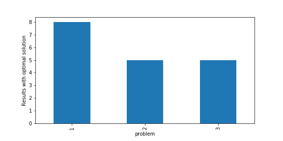

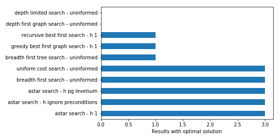

Out of 30 cases, we found that 18 cases have an optimal solution.

In Figure \ref{optimal-problem}, we see that an optimal solution was easier to
found for smaller problems. At this scale, finding an optimal solution could be
due to chance.

In Figure \ref{optimal-search}, we see that 4 search algorithms consistently
found an optimal solution. This confirms what we learned in the textbook
(@modern) about the optimality of certain algorithms, such as A*, breadth-first
search and uniform-cost search algorithm. On the other hand, other search
algorithms such as greedy-search and depth-first search do not have this
guarantee, which is shown in the results as well.

We also found some search algorithms, supposed to be optimal (@modern), but
without optimal solutions in our settings. This is the case for breadth-first
tree search. However, we observed in the previous section that these searches
were incomplete and thus did not have a solution.

Problem  | Search                                 | Plan length  | Optimal
:------: |:-------                                |------------: |:------:
1        | greedy best first graph search - h 1   | 6            | true
1        | astar search - h 1                     | 6            | true
1        | recursive best first search - h 1      | 6            | true
1        | astar search - h ignore preconditions  | 6            | true
1        | astar search - h pg levelsum           | 6            | true
1        | depth first graph search - uninformed  | 20           | false
1        | breadth first tree search - uninformed | 6            | true
1        | depth limited search - uninformed      | 50           | false
1        | uniform cost search - uninformed       | 6            | true
1        | breadth first search - uninformed      | 6            | true
2        | greedy best first graph search - h 1   | 15           | false
2        | astar search - h 1                     | 9            | true
2        | astar search - h ignore preconditions  | 9            | true
2        | astar search - h pg levelsum           | 9            | true
2        | depth limited search - uninformed      | 50           | false
2        | breadth first search - uninformed      | 9            | true
2        | depth first graph search - uninformed  | 619          | false
2        | uniform cost search - uninformed       | 9            | true
3        | greedy best first graph search - h 1   | 24           | false
3        | astar search - h 1                     | 12           | true
3        | astar search - h ignore preconditions  | 12           | true
3        | astar search - h pg levelsum           | 12           | true
3        | uniform cost search - uninformed       | 12           | true
3        | breadth first search - uninformed      | 12           | true
3        | depth first graph search - uninformed  | 392          | false

## Time Complexity

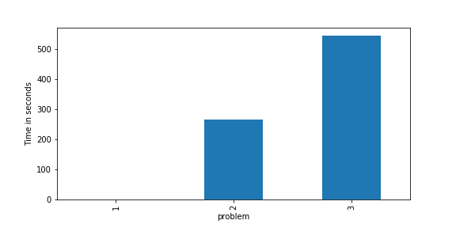

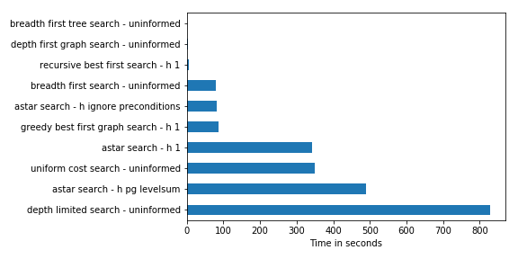

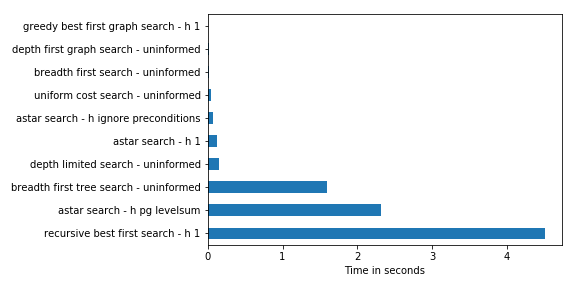

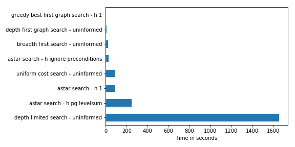

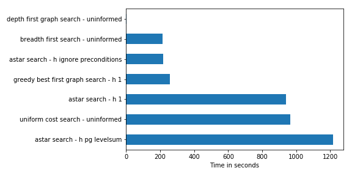

In Figure \ref{time-problem}, we can see that the time complexity varies greatly
between problems, from less than 1 second for Problem 1 to more than 500 seconds
on average for problem 3. This is due to the algorithmic complexity of search
algorithms, which is exponential in most cases (@modern).

In Figure \ref{time-search}, we see that the average runtime per search depends
on the algorithm. Greedy and depth-first searches tend to have smaller runtime
than breadth-first search and A* algorithms. On the other hand, the solutions
found by these algorithms were not optimal in our settings.

In the context of the Air Cargo Problem, finding an optimal solution is much
more important than the runtime of the search algorithm. A company would be more
inclined to spend on computer resources and avoid the cost of flying more planes
than necessary. The cost of the latter is much greater than the former. The only
constraint in this case is to find search algorithms with tractable executions.
We saw that is not the case for at least 4 algorithms.

## Space Complexity

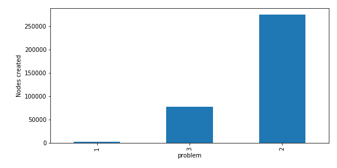

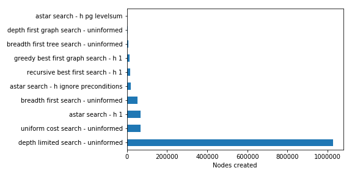

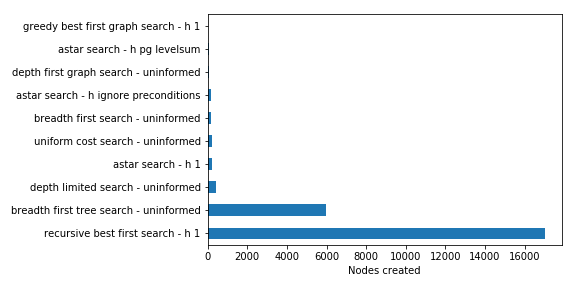

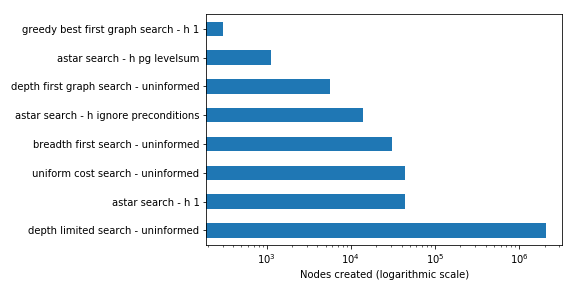

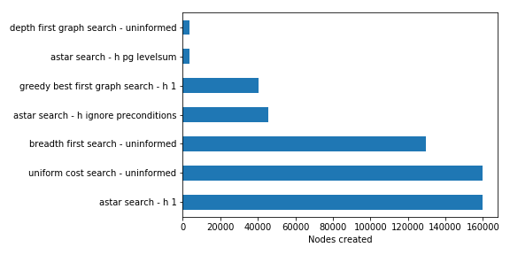

We may be surprised to find in Figure \ref{space-problem} than more nodes were
created for Problem 2 than Problem 3. This is because most searches could not be
completed for Problem 3, while they could in the case of Problem 2.

In Figure \ref{space-search}, it is striking to see the high number of node
created for depth-limited search compared to the other algorithms. In this case,
the depth-limited search does more work when the depth limit increases, causing
more node expansions than the other algorithms (@modern).

Overall, the number of node created is not a problem with the memory resources
we have on our machine today, as long as the search can finish.

\newpage

## Summary

__The following searches were incomplete__:

* recursive best first search - h 1
* depth limited search - uninformed
* breadth first tree search - uninformed

__The following searches do not have an optimal results__:

* depth limited search - uninformed
* greedy best first graph search - h 1
* depth first graph search - uninformed

__The following searches had a runtime greater than 400 seconds__

* astar search - h 1
* astar search - h pg levelsum
* uniform cost search - uninformed
* depth limited search - uninformed

__The following searches created more than 100 000 new nodes__:

* astar search - h 1
* uniform cost search - uninformed
* depth limited search - uninformed
* breadth first search - uninformed

__The following searches are not included in the previous listings__:

* astar search - h ignore preconditions

# Conclusion

In this report, we analyzed the characteristics of search algorithms and
confirmed the theory learned during the session (@modern). We noticed that even
for small problems, some algorithms were not tractable.

In particular, the capacity to find optimal and complete solution is critical in
the case of flying planes. The high cost of this activity can greatly benefit
from the solutions that some algorithms can provide. The main constraint is for
optimal algorithms to be tractable, both in time and space complexity.

The only algorithm which had this property is the A* search with the "ignore
preconditions" heuristic. This search was always optimal and complete in our
settings and had a lower runtime than the other heuristics. This heuristic also
exposed one of the critical insight that I learned through this session: __an
heuristic could be created automatically by relaxing the problem constraints__
(@modern). I think this is a powerful idea that could improve the automation of
AI techniques for new problem domain.

You can find the optimal solutions found for each problem in the appendix.

# Appendix

## Optimal plans

### Problem 1

#### Plan 1
Load(C1, P1, SFO)
Load(C2, P2, JFK)
Fly(P2, JFK, SFO)
Unload(C2, P2, SFO)
Fly(P1, SFO, JFK)
Unload(C1, P1, JFK)

#### Plan 2
Load(C2, P2, JFK)
Load(C1, P1, SFO)
Fly(P2, JFK, SFO)
Unload(C2, P2, SFO)
Fly(P1, SFO, JFK)
Unload(C1, P1, JFK)

#### Plan 3
Load(C1, P1, SFO)
Fly(P1, SFO, JFK)
Load(C2, P2, JFK)
Fly(P2, JFK, SFO)
Unload(C1, P1, JFK)
Unload(C2, P2, SFO)

#### Plan 4
Load(C1, P1, SFO)
Fly(P1, SFO, JFK)
Unload(C1, P1, JFK)
Load(C2, P2, JFK)
Fly(P2, JFK, SFO)
Unload(C2, P2, SFO)

#### Plan 5
Load(C1, P1, SFO)
Load(C2, P2, JFK)
Fly(P1, SFO, JFK)
Fly(P2, JFK, SFO)
Unload(C1, P1, JFK)
Unload(C2, P2, SFO)

### Problem 2

#### Plan 1
Load(C1, P1, SFO)
Fly(P1, SFO, JFK)
Load(C2, P2, JFK)
Fly(P2, JFK, SFO)
Load(C3, P3, ATL)
Fly(P3, ATL, SFO)
Unload(C3, P3, SFO)
Unload(C2, P2, SFO)
Unload(C1, P1, JFK)

#### Plan 2
Load(C1, P1, SFO)
Load(C2, P2, JFK)
Load(C3, P3, ATL)
Fly(P2, JFK, SFO)
Unload(C2, P2, SFO)
Fly(P1, SFO, JFK)
Unload(C1, P1, JFK)
Fly(P3, ATL, SFO)
Unload(C3, P3, SFO)

#### Plan 3
Load(C3, P3, ATL)
Fly(P3, ATL, SFO)
Unload(C3, P3, SFO)
Load(C2, P2, JFK)
Fly(P2, JFK, SFO)
Unload(C2, P2, SFO)
Load(C1, P1, SFO)
Fly(P1, SFO, JFK)
Unload(C1, P1, JFK)

### Problem 3

#### Plan 1
Load(C2, P2, JFK)
Fly(P2, JFK, ORD)
Load(C4, P2, ORD)
Fly(P2, ORD, SFO)
Unload(C4, P2, SFO)
Load(C1, P1, SFO)
Fly(P1, SFO, ATL)
Load(C3, P1, ATL)
Fly(P1, ATL, JFK)
Unload(C3, P1, JFK)
Unload(C2, P2, SFO)
Unload(C1, P1, JFK)

#### Plan 2
Load(C2, P2, JFK)
Fly(P2, JFK, ORD)
Load(C4, P2, ORD)
Fly(P2, ORD, SFO)
Load(C1, P1, SFO)
Fly(P1, SFO, ATL)
Load(C3, P1, ATL)
Fly(P1, ATL, JFK)
Unload(C4, P2, SFO)
Unload(C3, P1, JFK)
Unload(C2, P2, SFO)
Unload(C1, P1, JFK)

#### Plan 3
Load(C1, P1, SFO)
Fly(P1, SFO, ATL)
Load(C2, P2, JFK)
Fly(P2, JFK, ORD)
Load(C3, P1, ATL)
Load(C4, P2, ORD)
Fly(P2, ORD, SFO)
Unload(C4, P2, SFO)
Fly(P1, ATL, JFK)
Unload(C3, P1, JFK)
Unload(C2, P2, SFO)
Unload(C1, P1, JFK)

#### Plan 4
Load(C1, P1, SFO)
Load(C2, P2, JFK)
Fly(P2, JFK, ORD)
Load(C4, P2, ORD)
Fly(P1, SFO, ATL)
Load(C3, P1, ATL)
Fly(P1, ATL, JFK)
Unload(C1, P1, JFK)
Unload(C3, P1, JFK)
Fly(P2, ORD, SFO)
Unload(C2, P2, SFO)
Unload(C4, P2, SFO)

# References
